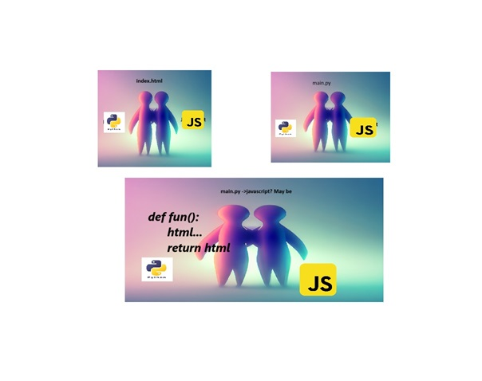

    

        <h2 class="presenter-title"><em style="color: #FDA703; font-style: normal; font-weight: bold;"></h2>
          <h3 class="presenter-title" style="padding: 0; font-size: 1.4em !important;">Web development in pyscript</h3>
          <h4 class="presenter-title" style="padding: 0; font-size: 1√em !important;">Pathan Nasrin Begum</h4>
           
          <h6 class="presenter-title" style="padding: 0; margin-top: 0; margin-bottom: 0;">
              <i class="fa fa-envelope"></i>
              <code class="contacts">nasrinbegump@gmail.com</code>
              <code class="contacts">nasrinpathan80@gmail.com</code>
          </h6>
           
          <h6 class="presenter-title" style="padding: 0; margin-top: 0; margin-bottom: 0;">
              <i class="fa fa-twitter"></i>
              <code class="contacts"></code>
      </h6>
    

    

        
    

---

    

        <h2>About Nasrin</h2>
    

    

        <ul>
            <li>founder of pyscript on PyCharm.</li>
            <li>Previously @ INSOFE(2019),SKILL TO HIRE,BYTECODE SOFTWARE SOLUTIONS LTD.</li>
        </ul>
    

---

<h2 style="text-transform: none;">
    Hello! 😍
</h2> 

---
## Traditional PyScript
---
 
---
Github beta blocks all desktop applications.
## What is Web development in New Advanced PyScript?
<ul class="fragment">
     <li class="fragment">
      Single page web development.
    </li>
    <li class="fragment">
      More secure.Less chances of scraping. 
    </li>   
---
First Website    
      
---
Second Website
          
---        
<h2>PyScript</h2>
<ul class="fragment">
     <li class="fragment">
      Yes pyscript replaced django  
    </li>
    <li class="fragment">
      python on browser 
    </li>
     <li class="fragment">
      Making use of packages on browser. 
    </li>
</ul>    
---
<h3>Interactive Python any where on web.</h3>
<ul>
<li>Is it possible to have multiple interactive Applications per page?Yes its possible for DOM but all of your pages must have same number of interactive Applications.</li>
</ul>
    
---
<h2>Making use of Python packages on web.</h2>

  
---
<h2>Bye...Bye... Desktop Applications.</h2>

<ul class="fragment">
    <li class="fragment">
      What's Going to happen when you deploy Desktop Application to Github?  
    </li>
         
    <li class="fragment">
      What's Going to happen when you manually write Desktop Application on Github? 
    </li>
         
---
<h4>Python and Javascript together.</h4>

---
<h2> Why PyScript?</h2>

<ul class="fragment">
    <li class="fragment">
      Free to use.  
    </li> 
    <li class="fragment">
      Easy Deployment.
    </li> 
     <li class="fragment">
      Single link no chance of scraping.
    </li>
    <li class="fragment">
      Security.
    </li>
     <li class="fragment">
      Support mobile and web.
    </li>
     <li class="fragment">
      Improved execution time.
    </li>
     <li class="fragment">
      Free Assistance.
    </li>
</ul>
    
---
<h2>Next thing coming? Web development in canvas.</h2>
(A good website is which shows the same on mobile and on browser.Web development in Canvas is an example for that...)
---
<h2>How to Get started? </h2>

<h4><a href="https://pyscript.com" target="_blank">pyscript.com</a></h4>

---

<a href="https://pyscript.github.io/docs/2024.3.2/user-guide/terminal/" target="_blank">Docs</a>

---

<a href="https://nasrin1748.github.io/pythonProject1/" target="_blank">Webdevelopment in Pyscript Example</a>
<a href="https://pyscript.com/@_12/user-inputs-copy-copy-copy-copy-copy/latest?files=main.py" target="_blank">Webdevelopment in Pyscript Example2</a>

---

<a href="https://pyscript.com/@_12/collections/fe0f0a2b-ecc3-42c0-b744-c6313e72c9ac" target="_blank">Fun Games</a>

---
<a href="https://pyscript.com/@_12/collections/3ed2ebb3-3c3c-4bf3-92c3-343c10c898a0" target="_blank">Animations</a>

---
<a href="https://www.youtube.com/@Project-nf3wo" target="_blank">YouTube</a>
<a href="https://x.com/PathanNasr61369" target="_blank">Twitter</a>
---

# Thank you!

